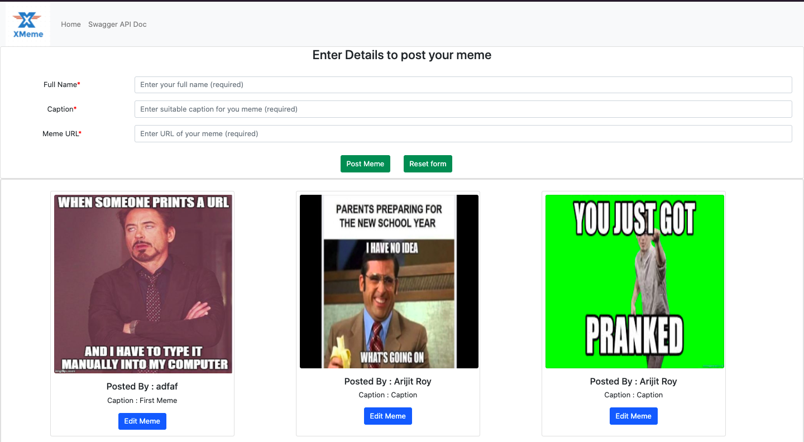
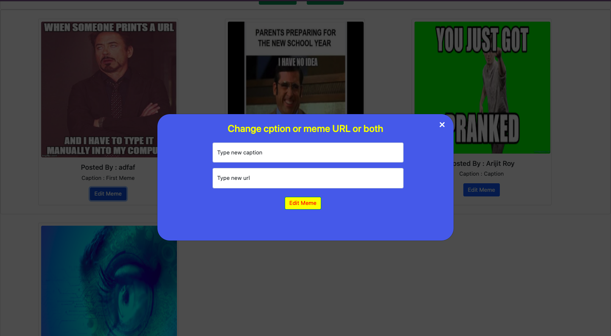
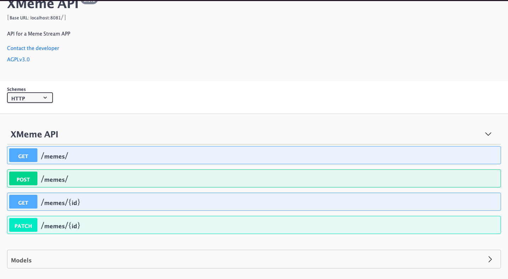

# Meme Stream App - XMeme
## Intro
This is a meme stream app where anyone can post memes.
  
## To post memes users have to provide three things - 
 
1. Name of the user who is posting the meme
  
2. Caption for the meme
  
3. URL of the meme

  
### In the main page there is a form which user have to fill to post a meme.

 

### Just below the form a list of latest 100 memes posted by various users is shown.

 

### When an user posts a new meme the timeiline below the form is automatically updated.

   

## Front Page :   
       
 

 

### Along with these there is another feature to edit a meme caption of meme-url or both.

 

There is a button added below each meme to edit the meme. when user will press the button a pop up window will appear. Where user have to provide atleast new caption or new meme-url.

  

 

## This app is built using the following tech-stack : 

 

### Front-End : HTML, CSS, Javascript

 

### Back-End : Express.js

 

### Database : MongoDB

 

## I have also added a swagger API doc so that anyone can interact with the backend of this app. The API consists of 4 methods - 

 

1. Get method to fetch list of latest 100 memes. <b>(End Point - /memes)</b>

 

2. Post method to post new meme. <b>(End Point - /memes)</b>

 

3. Get method to get a meme if ID is specified. <b>(End Point - /memes/:id)</b>

 

4. Patch method to update a meme <b>(End Point - /memes/:id)</b>
   
## Swagger API-DOC : 
 

 

### The backend is running on port 8081 and the swagger is running on port 8080. 